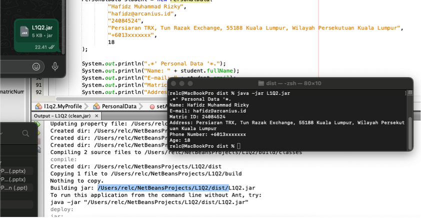
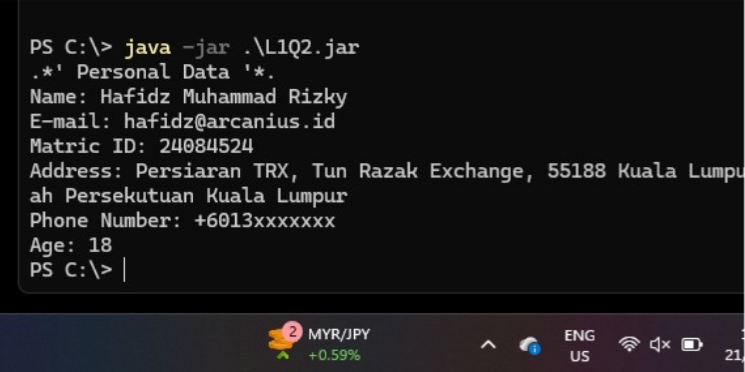
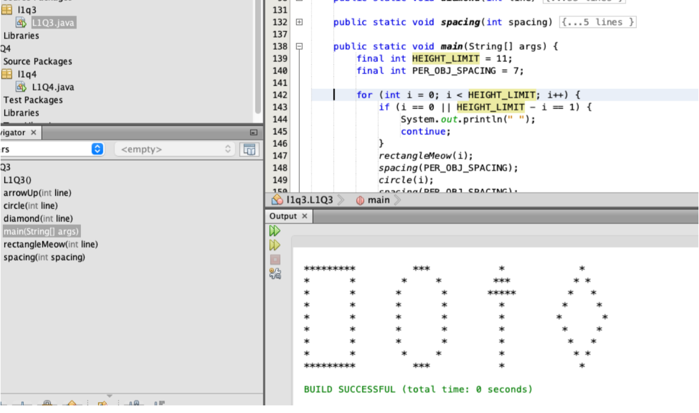
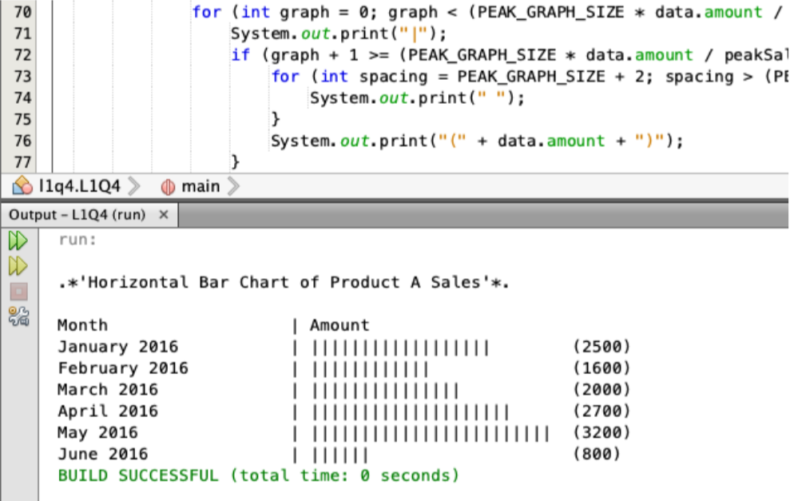

### Lab 1: Getting Started with Java

1. Create a new project named L1Q2 (use Java with Ant). Modify the main class to l1q2.MyProfile. You need to write a program to display your personal profile such as full name, matric number, address, email, contact and etc. After that, select the project and then Clean and Build. A jar file will be created in dist folder. (Exchange the jar file with your friend and you can execute the jar file in your PC.)

    1. Send the JAR file, and the file works on my laptop without a problem.
    

    2. JAR file is received, and the file works on other laptop without a problem.
    

2. Create a new project named L1Q3. The project will display the figure below.

    1. The output of the program is as expected.
    

    In order to output multiple figures in one line, it has to follow the same principle as a printer. To print line per line, in order to achieve this, in all of the shape logic, I gave them each the current line being processed by the main loop. 

    In order to output the same effect, where multiple figures can be printed in one line, it has to follow the same principle as a printer, where it goes line by line. To do this, I have to supply each figure (rectangle, oval, arrowUp, diamond) with the parameter of the current line, so it can output depending on which line it is now. 

    The rest is just pattern making with loops, and to give the spacing effect, I use a determined PER_OBJ_SPACING constant to loop spaces between figures. By far, the most complicated part was adjusting the diamond pattern, since it has to deal with its neighboring arrow up, and I have to fill the empty spaces, so the PER_OBJ_SPACING didn't have to guess how much to fill in. 

3. Create a new project named L1Q4. The project will display a chart (bar chart / line chart / pie chart) based on data in the table below. A chart is a graphical representation of data.

    1. The output of the program is as expected.
    

    For this instruction, I want to use the bar chart as a way to represent the table. In order to do this, first I need to figure out the formatting. I think the best formatting would be a horizontal bar chart. To figure out each of the bar sizes, I utilized the PEAK_GRAPH_SIZE * salesAmount / peakSalesAmount.
