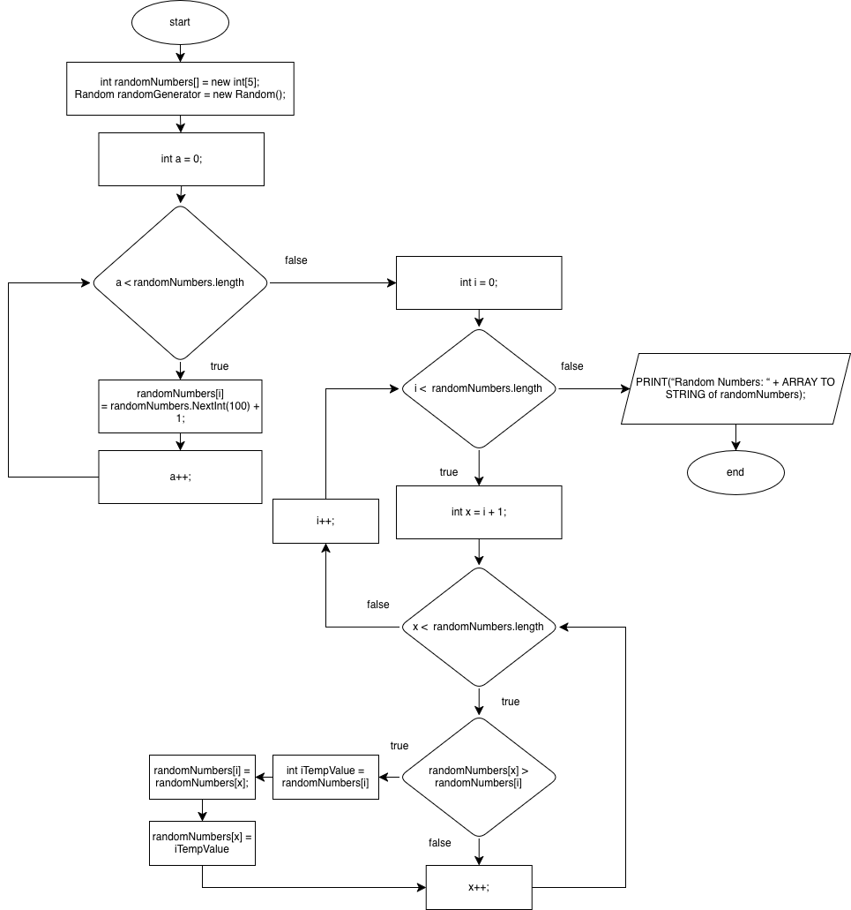

# WIX1002 Fundamentals of Programming
Hafidz Muhammad Rizky (24084524) - Artificial Intelligence 
### Tutorial 1: Problem Solving in Programming
#### Part I
1. Request two numbers from the user and print the multiplication of the numbers.
	##### Input-Process-Output Model:
	| Input       | Process     | Output      |
	|----------------|----------------|----------------|
	| firstNumber (user input)  secondNumber (user input)    | Multiply firstNumber * secondNumber and then SET it into a result variable      | Display result from the variable     |

	#### Pseudocode
	| Number       | Process     |
	|----------------|----------------|
	| 1    | START   |
	| 2    | DECLARE VARIABLE firstNumber, secondNumber, result AS INT  |
	| 3    | PRINT(“First Number : “); firstNumber = INPUT  |
	| 4    | PRINT(“Second Number : “); secondNumber = INPUT  |
	| 5    | result = firstNumber * secondNumber; PRINT(“Multiplication: “ + firstNumber + “ * “ + secondNumber + “ is “ + result);  |
	| 6    | END  |

	#### Flowchart
	
	
2. Determine whether a random number is greater than 50!
	##### Input-Process-Output Model:
	| Input       | Process     | Output      |
	|----------------|----------------|----------------|
    | randomNumber (generated using Random util library) | Fill the variable of randomNumber with random number   then, check if randomNumber > 50 | Display “Random Number of “ + number + “ is Greater than 50” or “Random Number of “ + number + “ is Not Greater than 50”

    ##### Pseudocode
    | Number       | Process     |
    |----------------|----------------|
    | 1    | START   |
    | 2    | DECLARE int randomNumber;  INSTANTIATING Random Object (new Random())  |
    | 3    | randomNumber = Random.nextInt(100);  |
    | 4    | IF randomNumber > 50 THEN &nbsp;&nbsp;&nbsp;&nbsp;PRINT(“Random Number of “ + randomNumber + “ is Greater than 50”) ELSE &nbsp;&nbsp;&nbsp;&nbsp;PRINT(“Random Number of “ + randomNumber + “ is Not Greater than 50”) ENDIF  |
    | 5    | END  |

    #### Flowchart
    

3. Print the pass/fail grade based on the mark entered by user. The passing mark is at least 40.
    #### Input-Process-Output Model:
    | Input       | Process     | Output      |
    |----------------|----------------|----------------|
    | Mark (user input) | Check Mark if >= 40 = pass; else fail | Display “Pass” or “Fail” | 

    #### Pseudocode
    | Number       | Process     |
    |----------------|----------------|
    | 1    | START   |
    | 2    | DECLARE mark as INT |
    | 3    | mark = INPUT | 
    | 4    | IF mark >= 40 THEN &nbsp;&nbsp;&nbsp;&nbsp;PRINT(“Pass”) ELSE &nbsp;&nbsp;&nbsp;&nbsp;PRINT(“Fail”) ENDIF  |
    | 5    | END  |

    #### Flowchart
    

4. Print the results of the two players’ dice game.
    #### Input-Process-Output Model:
    | Input       | Process     | Output      |
    |----------------|----------------|----------------|
    | secondPlayerDice (result from random) | Compare firstPlayerDice and secondPlayerDice to determine the end result. | Display “First Player Wins” if firstPlayerDice is greater than secondPlayerDice.   Display “Second Player Wins” if secondPlayerDice is greater than firstPlayerDice.   Else, display “Tie”|

    #### Pseudocode
    | Number       | Process     |
    |----------------|----------------|
    | 1    | START   |
    | 2    | DECLARE firstPlayerDice, secondPlayerDice AS INT
    | 3    | GENERATE random number from 1 to 6:   firstPlayerDice = (int) Math.floor(Math.random() * 6) + 1;  secondPlayerDice = (int) Math.floor(Math.random() * 6) + 1;  |
    | 4    | IF firstPlayerDice > secondPlayerDice THEN &nbsp;&nbsp;&nbsp;&nbsp;PRINT(“First Player Wins”); ELSE IF secondPlayerDice > firstPlayerDice THEN &nbsp;&nbsp;&nbsp;&nbsp;PRINT(“Second Player Wins”); ELSE &nbsp;&nbsp;&nbsp;&nbsp;PRINT(“Tie”); ENDIF  |
    | 5    | END  |

    #### Flowchart
    

5. Print the perimeter of a rectangle
    #### Input-Process-Output Model:
    | Input      | Process     | Output      |
    |----------------|----------------|----------------|
    | width (user input)  length (user input) | Calculate the perimeter using the formula of: 2 * (length + width). | Display the result of the rectangle perimeter. |

    #### Pseudocode
    | Number       | Process     |
    |----------------|----------------|
    | 1    | START   |
    | 2    | DECLARE length, width, result AS DOUBLE |
    | 3    | PRINT(“Length : “); length = INPUT  |
    | 4    | PRINT(“Width : “); width = INPUT  |
    | 5    | result = 2 * (length + width); |
    | 6    | PRINT(“The Perimeter of Rectangle is “ + result);  |
    | 7    | END  |

    #### Flowchart
    

6. Print the minimum number from 10 random numbers generated by computer.
    #### Input-Process-Output Model:
    | Input      | Process     | Output      |
    |----------------|----------------|----------------|
    | An array of 10 random numbers (generated) | Loop from the array of random numbers, if the number is smaller than before, set smallestNumber variable | Display the smallest / minimum number from the 10 randomly generated numbers. |

    #### Pseudocode
    | Number       | Process     |
    |----------------|----------------|
    | 1    | START   |
    | 2    | DECLARE int[] numbers = new int[10]; DECLARE int smallestNumber = 0; DECLARE randomGenerator AS new Random();|
    | 3    | LOOP FOR i = 0; i < numbers.length; i++ &nbsp;&nbsp;&nbsp;&nbsp;numbers[i] = randomGenerator.nextInt(100); ENDFOR  |
    | 4    | smallestNumber = numbers[0]; LOOP FOR c = 0; c < numbers.length; c++ &nbsp;&nbsp;&nbsp;&nbsp;IF numbers[c] < smallestNumber THEN &nbsp;&nbsp;&nbsp;&nbsp;&nbsp;&nbsp;&nbsp;&nbsp;smallestNumber = numbers[c]; &nbsp;&nbsp;&nbsp;&nbsp;ENDIF ENDFOR  |
    | 5    | PRINTLN(“Smallest Number : “ + smallestNumber); PRINTLN(“From Array of: “ + numbers TO STRING);  |
    | 6    | END |

    #### Flowchart
    

7. Print the number of odd and even number from 10 random numbers generated by computer. The random number must be from 10 – 100
    #### Input-Process-Output Model:
    | Input      | Process     | Output      |
    |----------------|----------------|----------------|
    | An array of 10 random numbers (generated from 10-100) | Loop through the array, find the modulus, if % 2 is 1, then it’s odd, else even | Display the total odd and even numbers from the 10 randomly generated numbers. |

    #### Pseudocode
    | Number       | Process     |
    |----------------|----------------|
    | 1    | START   |
    | 2    | DECLARE int[] numbers = new int[10]; DECLARE randomGenerator AS Random; DECLARE oddCount = 0, evenCount = 0; |
    | 3    | LOOP FOR int b = 0; b < numbers.length; b++ &nbsp;&nbsp;&nbsp;&nbsp;numbers[b] = numbers[b] = randomGenerator.nextInt(91) + 10; ENDFOR  |
    | 4    | LOOP FOR int a = 0; a < numbers.length; a++; &nbsp;&nbsp;&nbsp;&nbsp;IF numbers[a] % 2 == 1 THEN &nbsp;&nbsp;&nbsp;&nbsp;&nbsp;&nbsp;&nbsp;&nbsp;oddCount++; &nbsp;&nbsp;&nbsp;&nbsp;ELSE &nbsp;&nbsp;&nbsp;&nbsp;&nbsp;&nbsp;&nbsp;&nbsp;evenCount++; &nbsp;&nbsp;&nbsp;&nbsp;ENDIF ENDFOR  |
    | 5    | PRINT(“Odd Count: “ + oddCount); PRINT(“Even Count: “ + evenCount); | 
    | 6    | END | 

    #### Flowchart
    

#### Part II
8. Count the number of alphabet U and M from a sentence entered by user.
    #### Input-Process-Output Model:
    | Input      | Process     | Output      |
    |----------------|----------------|----------------|
    | sentence (user input) | Loop the character in the sentence and if it matches either ‘u’ or ‘m’, it increments the value of its respective variable. | Display the alphabetUCount and/or alphabetMCount in a sentence given. |

    #### Pseudocode
    | Number       | Process     |
    |----------------|----------------|
    | 1    | START   |
    | 2     | DECLARE sentence = INPUT; DECLARE alphabetUCount = 0, alphabetMCount = 0; |
    | 3    | LOOP FOR int a = 0; a < sentence.length(); a++; &nbsp;&nbsp;&nbsp;&nbsp;IF sentence.toLowerCase().charAt(a) == ‘u’ THEN &nbsp;&nbsp;&nbsp;&nbsp;&nbsp;&nbsp;&nbsp;&nbsp;alphabetUCount++; &nbsp;&nbsp;&nbsp;&nbsp;ELSE IF sentence.toLowerCase().charAt(a) == ‘m’ THEN &nbsp;&nbsp;&nbsp;&nbsp;&nbsp;&nbsp;&nbsp;&nbsp;alphabetMCount++; &nbsp;&nbsp;&nbsp;&nbsp;ENDIF ENDFOR  |
    | 4    | PRINT(“Count of ‘U’: “ + alphabetUCount); PRINT(“Count of ‘M’: “ + alphabetMCount);  |
    | 5    | END  |

    #### Flowchart
    

9. Display the frequency of a keyword from a web page.
    #### Input-Process-Output Model:
    | Input      | Process     | Output      |
    |----------------|----------------|----------------|
    | webPageContent (user input, the content of the web page)  keyword (user input, the keyword we’re looking for) | Split the web page content by their spaces or hyphen, creating collections of arrays, and store it. (Because every word in a sentence is ended with a space of hyphen)    Normalize the content and keyword into lowercase format, then compare with the keyword, if it matches increment count by 1. | Display the frequency count of a keyword, alongside the keyword itself to increase clarity. |

    #### Pseudocode
    | Number       | Process     |
    |----------------|----------------|
    | 1    | START   |
    | 2    | DECLARE String contentArray[] DECLARE webPageContent = INPUT; DECLARE keyword = INPUT; DECLARE frequency = 0; |
    | 3    | contentArray = SPLIT webPageContent WITH REGEX of ’[\\s-]+’; keyword = keyword.toLowerCase(); FOR int i = 0; i < contentArray.length; i++ &nbsp;&nbsp;&nbsp;&nbsp;IF contentArray[i].toLowerCase() EQUALS TO keyword THEN &nbsp;&nbsp;&nbsp;&nbsp;&nbsp;&nbsp;&nbsp;&nbsp;frequency++; &nbsp;&nbsp;&nbsp;&nbsp;ENDIF ENDFOR  |
    | 4    | PRINT(“Frequency of keyword:  ‘“ + keyword + “ is : “ + frequency);  |
    | 5    | END  |

    #### Flowchart
    

10. Display the number of female students from a random list of 100 students.
    #### Input-Process-Output Model:
    | Input      | Process     | Output      |
    |----------------|----------------|----------------|
    | studentData (user input, with gender in it) | Filter the list to only include female students, then calculate the length of the list. | Display the number/count of female students. |

    #### Pseudocode
    | Number       | Process     |
    |----------------|----------------|
    | 1    | START   |
    | 2    | DECLARE studentData = INPUT; DECLARE tempStudentData = ArrayList;|
    | 3    | Filter studentData by gender, convert back to array, and store in tempStudentData: tempStudentData = STREAM ARRAY OF studentData and FILTER s -> s.gender EQUALS TO female AND CONVERT TO ARRAY |
    | 4    | PRINT (“Number of female students: “ LENGTH OF tempStudentData);  |
    | 5    | END  |

    #### Flowchart
    

11. Display a list of 5 random numbers in descending order. (Sort)
    #### Input-Process-Output Model:
    | Input      | Process     | Output      |
    |----------------|----------------|----------------|
    | randomNumbers (an array of five random numbers) | Sort the number into a descending order. (Using Selection Sort, since it’s 5 numbers only) | Display the sorted number in a descending order. |

    #### Pseudocode
    | Number       | Process     |
    |----------------|----------------|
    | 1    | START   |
    | 2    | DECLARE int[] randomNumbers = new int[5]; DECLARE / Instantiating randomGenerator AS Random; |
    | 3    | LOOP FOR int a = 0; a < randomNumbers.length; a++ &nbsp;&nbsp;&nbsp;&nbsp;randomNumbers[a] = randomGenerator.nextInt(100) + 1; ENDFOR  |
    | 4    | LOOP FOR int i = 0; i < randomNumbers.length; i++ &nbsp;&nbsp;&nbsp;&nbsp;FOR int x = i + 1; x < randomNumbers.length; x++ &nbsp;&nbsp;&nbsp;&nbsp;&nbsp;&nbsp;&nbsp;&nbsp;IF randomNumbers[x] > randomNumbers[i] THEN &nbsp;&nbsp;&nbsp;&nbsp;&nbsp;&nbsp;&nbsp;&nbsp;&nbsp;&nbsp;&nbsp;&nbsp;int iValue = randomNumbers[i]; &nbsp;&nbsp;&nbsp;&nbsp;&nbsp;&nbsp;&nbsp;&nbsp;&nbsp;&nbsp;&nbsp;&nbsp;randomNumbers[i] = randomNumbers[x]; &nbsp;&nbsp;&nbsp;&nbsp;&nbsp;&nbsp;&nbsp;&nbsp;&nbsp;&nbsp;&nbsp;&nbsp;randomNumbers[x] = iValue; &nbsp;&nbsp;&nbsp;&nbsp;&nbsp;&nbsp;&nbsp;&nbsp;ENDIF &nbsp;&nbsp;&nbsp;&nbsp;ENDFOR ENDFOR  |
    | 5    | PRINT(“Random Numbers (Sorted): “ + ARRAY TO STRING of randomNumbers);  |
    | 6    | END  |

    #### Flowchart
    

12. Guess a random number generated by computer.
    #### Input-Process-Output Model:
    | Input      | Process     | Output      |
    |----------------|----------------|----------------|
    | userGuess (user input)  randomNumber (generated) | Compare guess with the generated randomNumber to check if it’s the same value, or higher, or smaller. | Display “Congratulations, you’re right” if guess is equal to randomNumber.   Display “Guess is too low” if guess is less than the randomNumber.  Display “Guess is too high” if guess is greater than the randomNumber. |

    #### Pseudocode
    | Number       | Process     |
    |----------------|----------------|
    | 1    | START   |
    | 2    | DECLARE randomGenerator AS Random (new Random()); DECLARE int randomNumber = randomGenerator.nextInt(100) + 1; DECLARE int guess = 0; |
    | 3    | DO:  &nbsp;&nbsp;&nbsp;&nbsp;PRINT(“Your Guess: ”); &nbsp;&nbsp;&nbsp;&nbsp;guess = INPUT; &nbsp;&nbsp;&nbsp;&nbsp;IF (guess == randomNumber) THEN &nbsp;&nbsp;&nbsp;&nbsp;&nbsp;&nbsp;&nbsp;&nbsp;PRINT(“Congratulations, you’re right”); &nbsp;&nbsp;&nbsp;&nbsp;ELSE IF (guess > randomNumber) THEN &nbsp;&nbsp;&nbsp;&nbsp;&nbsp;&nbsp;&nbsp;&nbsp;PRINT(“Guess is too high”); &nbsp;&nbsp;&nbsp;&nbsp;ELSE &nbsp;&nbsp;&nbsp;&nbsp;&nbsp;&nbsp;&nbsp;&nbsp;PRINT(“Guess is too low”); &nbsp;&nbsp;&nbsp;&nbsp;ENDIF WHILE (guess != randomNumber)  |
    | 4    | END  |

    #### Flowchart
    
